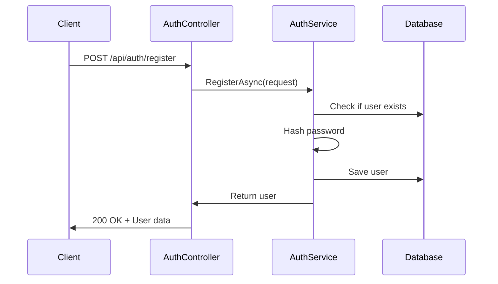
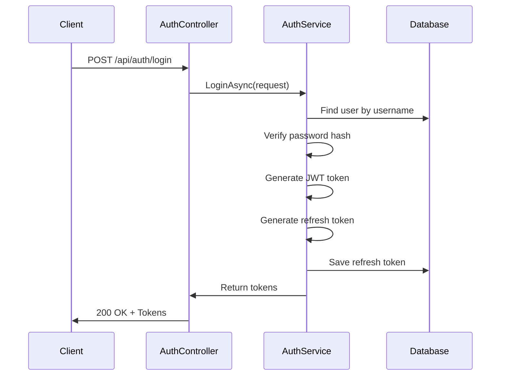
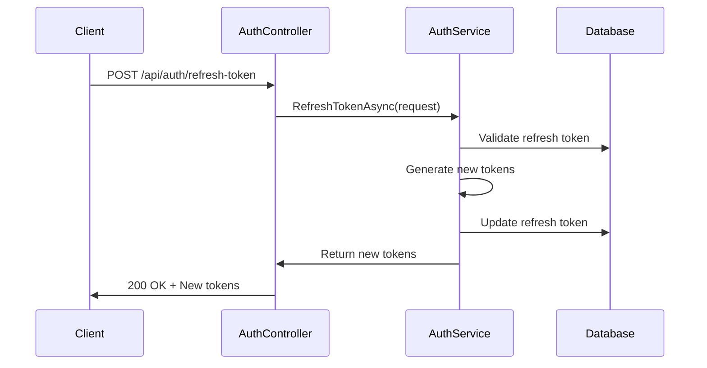

# JWT Authentication with ASP.NET Core

A comprehensive guide to implementing JWT (JSON Web Token) authentication in ASP.NET Core with Entity Framework Core, including user registration, login, role-based authorization, and refresh tokens.

## 📋 Table of Contents

- [Project Overview](#project-overview)
- [Quick Start](#quick-start)
- [Project Structure](#project-structure)
- [Setup & Configuration](#setup--configuration)
- [Core Components](#core-components)
- [Authentication Flow](#authentication-flow)
- [API Endpoints](#api-endpoints)
- [Database Integration](#database-integration)
- [Security Features](#security-features)
- [Testing](#testing)

## 🎯 Project Overview

This project demonstrates a complete JWT authentication system with the following features:

- ✅ User registration and login
- ✅ JWT token generation and validation
- ✅ Password hashing with ASP.NET Core Identity
- ✅ Role-based authorization
- ✅ Refresh token mechanism
- ✅ Entity Framework Core with SQL Server
- ✅ OpenAPI/Swagger documentation

## 🚀 Quick Start

### Prerequisites
- .NET 8.0 SDK
- Docker (for SQL Server)
- SQL Server Management Studio (optional)

### 1. Clone and Setup
```bash
# Navigate to project directory
cd JwtAuthDotNet/JwtAuth

# Install dependencies
dotnet restore

# Build the project
dotnet build
```

### 2. Database Setup
```bash
# Start SQL Server in Docker
docker run -e "ACCEPT_EULA=Y" -e 'SA_PASSWORD=StrongP@ssw0rd!' \
  --platform linux/amd64 -p 1433:1433 \
  --name sqlserver -d mcr.microsoft.com/mssql/server:2022-latest

# Install Entity Framework tools
dotnet tool install --global dotnet-ef

# Create and apply migrations
dotnet ef migrations add Initial
dotnet ef database update
```

### 3. Generate JWT Secret
```bash
# Generate a secure secret for JWT signing
openssl rand -base64 64
```

### 4. Configure Settings
Update `appsettings.json` with your generated secret:

```json
{
  "ConnectionStrings": {
    "DefaultConnection": "Server=localhost,1433;Database=JwtAuthDb;User Id=sa;Password=StrongP@ssw0rd!;TrustServerCertificate=True;"
  },
  "AppSettings": {
    "Token": "YOUR_GENERATED_SECRET_HERE",
    "Issuer": "your-app-name",
    "Audience": "your-app-name"
  }
}
```

### 5. Run the Application
```bash
# Development mode with hot reload
dotnet watch run

# Or standard run
dotnet run
```

### 6. Access the API
- **API Documentation**: `http://localhost:5008/scalar/v1`
- **OpenAPI JSON**: `http://localhost:5008/openapi/v1.json`
- **Base URL**: `http://localhost:5008/api/auth`

## 📁 Project Structure

```
JwtAuth/
├── Controllers/
│   ├── AuthController.cs          # Authentication endpoints
│   └── Data/
│       ├── UserDbContext.cs       # Database context
│       ├── TokenResponseDto.cs    # Token response model
│       └── RefreshTokenRequestDto.cs
├── Entities/
│   ├── User.cs                    # User entity model
│   └── Models/
│       └── UserDto.cs             # User data transfer object
├── Services/
│   ├── IAuthService.cs            # Authentication service interface
│   └── AuthService.cs             # Authentication service implementation
├── Migrations/                    # Entity Framework migrations
├── Program.cs                     # Application configuration
└── appsettings.json              # Configuration settings
```

## ⚙️ Setup & Configuration

### Required NuGet Packages

```bash
# Core packages
dotnet add package Microsoft.EntityFrameworkCore
dotnet add package Microsoft.EntityFrameworkCore.SqlServer
dotnet add package Microsoft.EntityFrameworkCore.Tools

# Authentication & JWT
dotnet add package Microsoft.AspNetCore.Authentication.JwtBearer
dotnet add package System.IdentityModel.Tokens.Jwt

# API Documentation
dotnet add package Scalar.AspNetCore
```

### Program.cs Configuration

```csharp
var builder = WebApplication.CreateBuilder(args);

// Add services
builder.Services.AddControllers();
builder.Services.AddOpenApi();

// Database context
builder.Services.AddDbContext<UserDbContext>(options => 
    options.UseSqlServer(builder.Configuration.GetConnectionString("DefaultConnection")));

// Authentication service
builder.Services.AddScoped<IAuthService, AuthService>();

// JWT Authentication
builder.Services.AddAuthentication(JwtBearerDefaults.AuthenticationScheme)
    .AddJwtBearer(options =>
    {
        options.TokenValidationParameters = new TokenValidationParameters
        {
            ValidateIssuer = true,
            ValidateAudience = true,
            ValidateLifetime = true,
            ValidateIssuerSigningKey = true,
            ValidIssuer = builder.Configuration["AppSettings:Issuer"],
            ValidAudience = builder.Configuration["AppSettings:Audience"],
            IssuerSigningKey = new SymmetricSecurityKey(
                Encoding.UTF8.GetBytes(builder.Configuration["AppSettings:Token"]!)),
        };
    });

var app = builder.Build();

// Middleware pipeline
app.UseHttpsRedirection();
app.UseAuthentication();
app.UseAuthorization();
app.MapControllers();
```

## 🏗️ Core Components

### 1. User Entity Model

```csharp
// Entities/User.cs
namespace JwtAuth.Entities
{
    public class User
    {
        public Guid Id { get; set; }
        public string Username { get; set; } = string.Empty;
        public string PasswordHash { get; set; } = string.Empty;
        public string Role { get; set; } = string.Empty;
        public string? RefreshToken { get; set; }
        public DateTime RefreshTokenExpiryTime { get; set; }
    }
}
```

### 2. Data Transfer Objects (DTOs)

```csharp
// Entities/Models/UserDto.cs
namespace JwtAuth.Entities.Models
{
    public class UserDto
    {
        public string Username { get; set; } = string.Empty;
        public string Password { get; set; } = string.Empty;
    }
}

// Controllers/Data/TokenResponseDto.cs
namespace JwtAuth.Controllers.Data
{
    public class TokenResponseDto
    {
        public required string AccessToken { get; set; }
        public required string RefreshToken { get; set; }
    }
}
```

### 3. Database Context

```csharp
// Controllers/Data/UserDbContext.cs
using JwtAuth.Entities;
using Microsoft.EntityFrameworkCore;

namespace JwtAuth.Controllers.Data
{
    public class UserDbContext(DbContextOptions<UserDbContext> options) : DbContext(options)
    {
        public DbSet<User> Users { get; set; } = null!;
    }
}
```

### 4. Authentication Service Interface

```csharp
// Services/IAuthService.cs
using JwtAuth.Entities;
using JwtAuth.Entities.Models;
using JwtAuth.Controllers.Data;

namespace JwtAuth.Services
{
    public interface IAuthService
    {
        Task<User> RegisterAsync(UserDto request);
        Task<TokenResponseDto?> LoginAsync(UserDto request);
        Task<TokenResponseDto?> RefreshTokenAsync(TokenResponseRequestDto request);
    }
}
```

## 🔐 Authentication Flow

### 1. User Registration Flow



### 2. User Login Flow



### 3. Token Refresh Flow



## 🌐 API Endpoints

### Authentication Endpoints

| Method | Endpoint | Description | Request Body | Response |
|--------|----------|-------------|--------------|----------|
| POST | `/api/auth/register` | Register new user | `UserDto` | `User` |
| POST | `/api/auth/login` | User login | `UserDto` | `TokenResponseDto` |
| POST | `/api/auth/refresh-token` | Refresh access token | `TokenResponseRequestDto` | `TokenResponseDto` |

### Protected Endpoints

| Method | Endpoint | Description | Authorization |
|--------|----------|-------------|---------------|
| GET | `/api/auth` | Test authenticated access | `Bearer Token` |
| GET | `/api/auth/admin-only` | Admin-only endpoint | `Bearer Token + Admin Role` |

### Example API Calls

#### Register User
```bash
curl -X POST "http://localhost:5008/api/auth/register" \
  -H "Content-Type: application/json" \
  -d '{
    "username": "john_doe",
    "password": "securepassword123"
  }'
```

#### Login User
```bash
curl -X POST "http://localhost:5008/api/auth/login" \
  -H "Content-Type: application/json" \
  -d '{
    "username": "john_doe",
    "password": "securepassword123"
  }'
```

#### Access Protected Endpoint
```bash
curl -X GET "http://localhost:5008/api/auth" \
  -H "Authorization: Bearer YOUR_JWT_TOKEN"
```

#### Refresh Token
```bash
curl -X POST "http://localhost:5008/api/auth/refresh-token" \
  -H "Content-Type: application/json" \
  -d '{
    "userId": "user-guid-here",
    "refreshToken": "refresh-token-here"
  }'
```

## 🗄️ Database Integration

### Entity Framework Migrations

```bash
# Create initial migration
dotnet ef migrations add Initial

# Apply migrations to database
dotnet ef database update

# Remove last migration (if needed)
dotnet ef migrations remove

# Generate SQL script
dotnet ef migrations script
```

### Database Schema

The application creates a `Users` table with the following structure:

```sql
CREATE TABLE [Users] (
    [Id] uniqueidentifier NOT NULL,
    [Username] nvarchar(max) NOT NULL,
    [PasswordHash] nvarchar(max) NOT NULL,
    [Role] nvarchar(max) NOT NULL,
    [RefreshToken] nvarchar(max) NULL,
    [RefreshTokenExpiryTime] datetime2 NOT NULL,
    CONSTRAINT [PK_Users] PRIMARY KEY ([Id])
);
```

## 🔒 Security Features

### 1. Password Hashing
Uses ASP.NET Core Identity's `PasswordHasher` for secure password storage:

```csharp
// Hashing password during registration
var hashedPassword = new PasswordHasher<User>().HashPassword(user, request.Password);

// Verifying password during login
var result = new PasswordHasher<User>().VerifyHashedPassword(user, user.PasswordHash, request.Password);
if (result == PasswordVerificationResult.Failed)
{
    return null; // Invalid password
}
```

### 2. JWT Token Security
- **Algorithm**: HMAC SHA512
- **Expiration**: 1 day for access tokens
- **Claims**: Username, User ID, Role
- **Validation**: Issuer, Audience, Lifetime, Signing Key

### 3. Refresh Token Security
- **Expiration**: 7 days
- **Storage**: Database with user association
- **Generation**: Cryptographically secure random bytes
- **Validation**: User ID + token + expiry check

### 4. Role-Based Authorization
```csharp
[Authorize] // Requires valid JWT token
[HttpGet]
public IActionResult AuthenticatedOnlyEndpoints()
{
    return Ok("You are authenticated!");
}

[Authorize(Roles = "Admin")] // Requires Admin role
[HttpGet("admin-only")]
public IActionResult AdminOnlyEndpoints()
{
    return Ok("You are Admin");
}
```

## 🧪 Testing

### Manual Testing with curl

1. **Register a new user**:
```bash
curl -X POST "http://localhost:5008/api/auth/register" \
  -H "Content-Type: application/json" \
  -d '{"username": "testuser", "password": "testpass"}'
```

2. **Login and get tokens**:
```bash
curl -X POST "http://localhost:5008/api/auth/login" \
  -H "Content-Type: application/json" \
  -d '{"username": "testuser", "password": "testpass"}'
```

3. **Test protected endpoint**:
```bash
curl -X GET "http://localhost:5008/api/auth" \
  -H "Authorization: Bearer YOUR_ACCESS_TOKEN"
```

### Testing with Swagger/Scalar

1. Open `http://localhost:5008/scalar/v1` in your browser
2. Use the interactive API documentation
3. Test endpoints directly from the UI

## 📚 Key Learning Points

### 1. JWT Token Structure
- **Header**: Algorithm and token type
- **Payload**: Claims (user info, expiration, etc.)
- **Signature**: Verifies token authenticity

### 2. Authentication vs Authorization
- **Authentication**: Verifying user identity (login)
- **Authorization**: Checking user permissions (roles)

### 3. Token Types
- **Access Token**: Short-lived, for API access
- **Refresh Token**: Long-lived, for getting new access tokens

### 4. Security Best Practices
- Never store sensitive data in JWT payload
- Use HTTPS in production
- Implement token expiration
- Validate all token claims
- Use secure random secrets

## 🚨 Common Issues & Solutions

### 1. Database Connection Issues
```bash
# Check if SQL Server is running
docker ps

# Restart SQL Server container
docker restart sqlserver

# Check connection string in appsettings.json
```

### 2. JWT Token Issues
```bash
# Verify secret in appsettings.json
# Ensure secret is at least 64 characters
# Check issuer and audience values
```

### 3. Migration Issues
```bash
# Remove existing migrations and recreate
dotnet ef migrations remove
dotnet ef migrations add Initial
dotnet ef database update
```

## 🔄 Development Workflow

1. **Make changes** to entities, services, or controllers
2. **Create migration** if database schema changes:
   ```bash
   dotnet ef migrations add MigrationName
   ```
3. **Update database**:
   ```bash
   dotnet ef database update
   ```
4. **Test endpoints** using curl or Swagger
5. **Monitor logs** for any errors

## 📖 Additional Resources

- [JWT.io](https://jwt.io/) - JWT token decoder and debugger
- [ASP.NET Core Authentication](https://docs.microsoft.com/en-us/aspnet/core/security/authentication/)
- [Entity Framework Core](https://docs.microsoft.com/en-us/ef/core/)
- [JWT Bearer Authentication](https://docs.microsoft.com/en-us/aspnet/core/security/authentication/jwt-authn)

---

**Happy Coding! 🚀**
